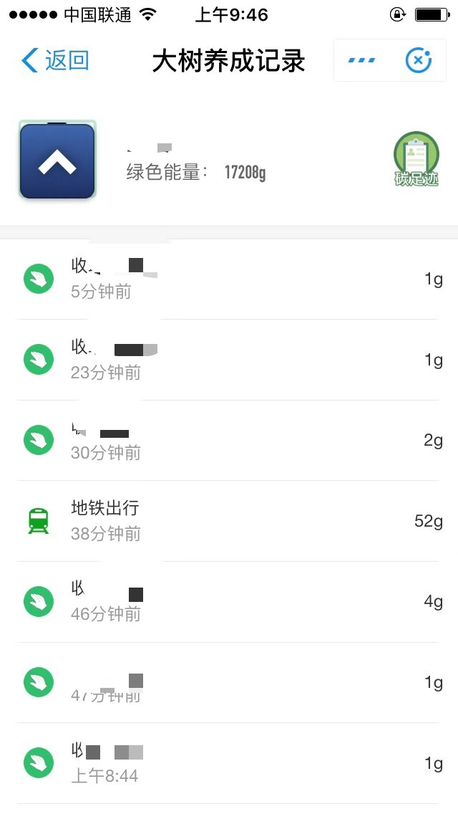

# Alipay_AntForest
iOS版支付宝，一键收取蚂蚁森林全部好友能量，一键帮好友收取能量，定时收取能量，为好友浇水

## 功能概况
- 本文是根据网友的 [iOS逆向-手把手教你写支付宝蚂蚁森林收集能量助手](https://blog.csdn.net/kissing_huo/article/details/78548942?locationNum=8) 做了功能完善和扩展，详细的分析过程，请参见该文章。

- 新增功能：一键收取蚂蚁森林全部好友能量，一键帮好友收取能量，定时收取能量。2018-10-05,新增“一键浇水”功能

- 代码仅供学习交流，感谢您 帮忙在右上角 点个“⭐️”，非常感谢。


## 内容：

- 1、遍历全部好友，筛选出可收取能量的好友和可被帮助收取能量的好友。

好友排名数组：
```
friendRanking : [
		{
		realName : 0,
		forestUser : 0,
		treeAmount : 10,
		rank : 1,
		canCollectLaterTime : -1,
		userId : 2088xxxxxxxxxxx11,
		canCollectEnergy : 0,
		collectableBubbleCount : 0,
		energySummation : 216671,
		headPortrait : ,
		displayName : ,
		canHelpCollect : 0
	}]
```
其中canCollectEnergy为1时，可收取；canHelpCollect为1时，可被帮助收取。


- 2、遍历单个好友的全部能量，筛选出能被收取或能被帮助收取的能量。

好友的能量气泡数组：
```
bubbles : [
		{
		collectStatus : INSUFFICIENT,		//收取状态，INSUFFICIENT 不足的，AVAILABLE 可收取，
		userId : 2088xxxxxxxxxx384,			//用户的id
		canHelpCollect : 1,					//是否可被帮助收取
		id : 76012195,						//气泡的id
		produceTime : 1536934343000,
		fullEnergy : 52,
		overTime : 1537193543000,
		business : {
		nightIconUrl : https://zos.alipayobjects.com/rmsportal/GydawUvGZiOzxMM.png,
		id : 2,
		bizType : ditie,
		smallIconDisplayName : 地铁出行,
		bigIconDisplayName : 地铁出行,
		dayIconUrl : https://zos.alipayobjects.com/rmsportal/ulnllVtPwKlmuEb.png
	}]
```


- 3、根据当前能量的collectStatus为AVAILABLE则可被收取，执行收取；根据当前能量的canHelpCollect为1则可被帮助收取，执行帮助收取。


- 4、定时收取能量
点击“定时”则开启定时器。

2018-12-27更新，优化了能量收取逻辑。使用数据库保存好友排名和能量气泡，每10秒执行一次收取，数据库中的能量气泡的produceTime字段与当前时间戳比较。

2018-12-28更新，跟新界面UI，更新功能逻辑，提高收取能量成功率。
<div align=center></div>

<div align=center></div>


- 5、一键为多个好友浇水
在好友的界面点击“加入浇水”才能把当前好友加入浇水数组，可添加多个好友。点击“一键浇水”可同时为多个好友浇水，为每位好友浇水三次。自行到各个好友界面查看，可看到你为该好友的浇水记录。

## 操作说明
- 1、先“收集好友”，请求网络获取全部好友并保存到本地数据库。如果以后好友没有变化，都不需要再收集好友了。
- 2、“收集气泡”，根据本地好友信息，逐个查询好友的可用气泡，保存到本地数据库。
- 3、“定时收取”，每10秒执行一次，根据本地数据库中的气泡信息，逐个判断气泡是否可收取，可收取则请求网络收取能量。如果本地数据库中已无能量气泡，可点击“定时收取”更新气泡。
- 4、“加入浇水”，进入好友的蚂蚁森林，点击“加入浇水”，把当前好友加入浇水队列。
- 5、“清空浇水”，可清空全部浇水队列。
- 6、“执行浇水”，可为浇水队列中的好友浇水3次。

## 开发环境
- Xcode 8.2
- MonkeyDev

## 测试环境
- 越狱手机 iOS 9.3.3
- 支付宝版本 10.1.32


## 多谢支持 ^_^
<div align=center><t/></div>

## 关注公众号
<div align=center>


